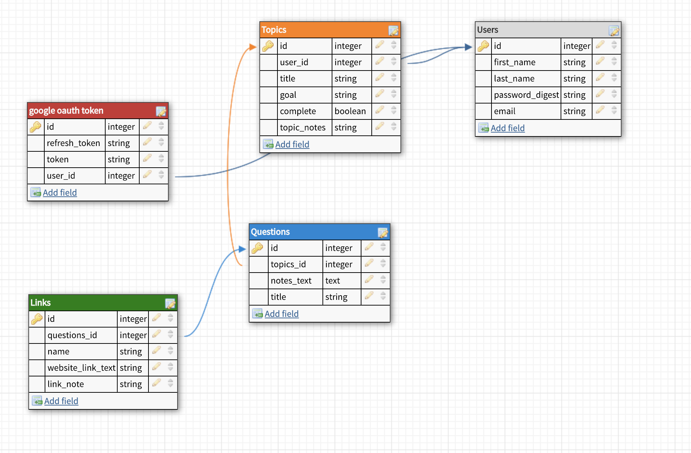

# README
## Rabbit-Hole

RabbitHole is a customized web application designed to help users learn new content more efficiently through consumption of online resources. RabbitHole provides an organizational structure around the online research process through an interactive GUI where users document research topics, specific questions, notes, and resource links. RabbitHole utilizes the Bing v7 Search API to continually generate resources directly related to a user's topic and question. Google OAuth is used for user registration and login.

### Setup:

To begin, clone this repo:

```
git@github.com:Isaac-Falkenstine/Rabbit-Hole.git
```
After you `cd` into the project directory, run `bundle install` from the command line.
Next, run `bundle exec rake db:{drop,create,migrate}` to create the database and schema.

At this point, you should be able to run the local test suite using `bundle exec rspec`.

### Gems:

#### Main
- gem 'figaro'
- gem 'faraday'
- gem 'sendgrid-ruby'
- gem 'google-api-client', req
- gem 'omniauth-google-oauth2'
- gem 'bcrypt'
- gem 'webpacker'
- gem'jquery-rails'
- gem 'popper_js'
- gem 'simple_form'

#### Testing
- gem 'rspec-rails'
- gem 'launchy'
- gem 'webmock'
- gem 'vcr'
- gem 'capybara'
- gem 'shoulda-matchers'  
- gem 'simplecov'
- gem 'database_cleaner'
- gem 'factory_bot_rails'
- gem 'pry'
- gem 'selenium-webdriver'

### Schema:



### Requirements, Access, Security:

You will need a Bing v7 Search Key, and a Google Oauth Client Key and Secret. Set these keys as environment variables in the application.yml file that is generated when Figaro is installed (type `figaro install` into your terminal at the root of the application).


### Near Term Functionality:
- Editing profile information.
- Editing/deleting topics, links, questions.
- Scroll bar for Bing Links and ability to set how many links a user wants displayed.
- Admin functionality.

### Future Iterations:

- Incorporating Google Calendar to schedule to-do's.
- Rendering web page content within the app.
- Creating a mobile version.


### Contributing:

In order to contribute, please fork this repo, then clone your new repo and create a branch for your feature.

Please make sure to test your feature fully, using RSpec, before commiting your changes and pushing to your own repo, then create and submit a pull request back to this repository.

