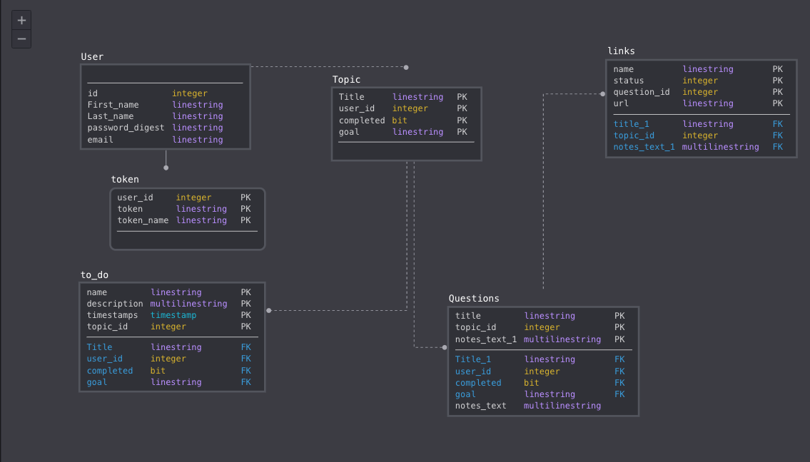

# README
## Rabbit-Hole

RabbitHole is a customized web application that helps users learn new things more efficiently through the infinite resources on the internet by providing organizational structure around the online research process through an interactive GUI.

### Setup:

To begin, clone this repo:

```
git@github.com:Isaac-Falkenstine/Rabbit-Hole.git
```
After you `cd` into the project directory, run `bundle install` from the command line.
Next, run `bundle exec rake db:{drop,create,migrate}` to create the database and schema.

At this point, you should be able to run the local test suite using `bundle exec rspec`.

### gems:

- rails
-ruby 
-'rails'
-'pg'
-'puma'
-'sass-rails'
-'uglifier' 
-'mini_racer'
-'coffee-rails'
-'jbuilder'
-'figaro'
-'sendgrid-ruby'
-'google-api-client', req
-'omniauth-google-oauth2'
-'redis'
-'bcrypt'
-'mini_magick'
-'webpacker'
-'bootsnap'
-'jquery-rails'
- 'popper_js'
-'webdrivers"
-'simple_form'
-'byebug'
-'rspec-rails'
-'launchy'
-'webmock'
-'vcr'
-'capybara'
-'shoulda-matchers'  
-'simplecov'
-'database_cleaner'
-'factory_bot_rails'
-'pry'
-'selenium-webdriver'
-'web-console'
-'listen'
-'tzinfo-data'

### Schema:



### Requirements, Access, Security:

You will need a Bing v7 Search Key, and a google oauth key that you put in your application.yml file that is generated when you type 'figaro install' into your terminal. 


### Future Iterations:

- Future iterations would involve creating a mobile version of this app.

-	

### Contributing:

In order to contribute, please fork this repo, then clone your new repo and create a branch for your feature.

Please make sure to test your feature fully, using RSpec, before commiting your changes and pushing to your own repo, then create and submit a pull request back to this repository.

